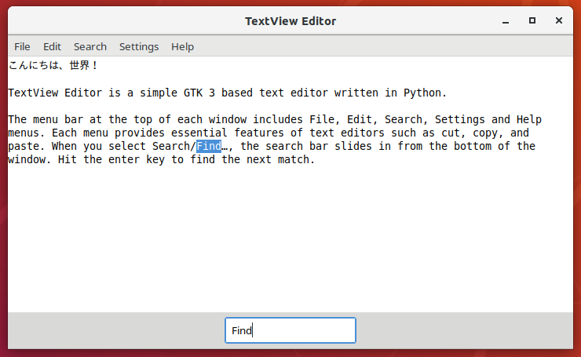

# TextView Editor ― A Simple GTK 3 based Text Editor written in Python

## Usage

```
$ ./textview-editor.py [filename...]
```

## Screenshot



## Description

TextView Editor is a simple [GTK](https://www.gtk.org/) 3 based text editor written in Python.

In TextView Editor, a [Gtk.Application](https://python-gtk-3-tutorial.readthedocs.io/en/latest/application.html) manages multiple [Gtk.ApplicationWindow](https://developer.gnome.org/gtk3/stable/GtkApplicationWindow.html)s. Each application window contains only a [Gtk.ScrolledWindow](https://developer.gnome.org/pygtk/stable/class-gtkscrolledwindow.html) widget and a [Gtk.TextView](https://developer.gnome.org/pygtk/stable/class-gtktextview.html) widget.

The menu bar at the top of each window includes File, Edit, and Help menus. Each menu provides essential features of text editors such as cut, copy, and paste.

Basic text editing features are provided by Gtk.TextView and its [Gtk.TextBuffer](https://developer.gnome.org/pygtk/stable/class-gtktextbuffer.html). One feature that is missing in Gtk.TextView and Gtk.TextBuffer is the ability to undo and redo. TextView Editor provides an edit history feature by monitoring "insert_text" and "delete_range" signals raised from Gtk.TextBuffer.

TextView Editor is released under the GNU Lesser General Public License. Simple text editors would have been a good starting point to learn about GUI programming. TextView Editor is intended to be one of those programs.

## Note about Internationalization

A modeless Input Method Engine (modeless IME) is an emerging technology to input Japanese characters. [ibus-replace-with-kanji](https://github.com/esrille/ibus-replace-with-kanji) is an example of such modeless IMEs.

To enter Chinese characters "漢字" with a modeless IME, we use the following steps.

1. Type "かんじ", which is the Japanese [Hiragana](https://en.wikipedia.org/wiki/Hiragana) string for "漢字".
2. Hit [Convert] key to convert a Hiragana string into Chinese characters.
3. Then, a modeless IME deletes "かんじ" by [delete_surrounding_text()](http://ibus.github.io/docs/ibus-1.5/IBusEngine.html#ibus-engine-delete-surrounding-text), and inserts "漢字" by [commit_text()](http://ibus.github.io/docs/ibus-1.5/IBusEngine.html#ibus-engine-commit-text).

In Step 3, a "delete_range" signal and an "insert_text" signal are issued from Gtk.TextBuffer as the result of delete_surrounding_text() and commit_text() respectively.

So when we undo the convert operation in Step 2, it is preferable if the previous "delete_range" and "insert_text" operations are revoked at the same time. Probably it is better if an IME framework provides replace_surrounding_text() API instead of delete_surrounding_text() and commit_text(). See [User Interface: A Personal View](http://www.vpri.org/pdf/hc_user_interface.pdf) by Alan Kay for the design principles.

Anyway, the recent PCs are fast enough to distinguish signals issued by human and by IME. If a "delete_range" signal and an "insert_text" signal are issued very closely in time, like within 1 msec, they are likely to be issued by IME. In TextView Editor, if two signals were issued very closely in time, the Undo command revokes both operations at one time.

Note with the classic IMEs, we use the following steps to enter "漢字".

1. Type "かんじ", which are kept in the IME's pre-edit text buffer.
2. Hit [Convert] key.
3. The IME converts the text in the pre-edit text buffer into "漢字".
4. Hit [Enter] key.
5. The IME inserts "漢字" into the text editor by commit_text(), and clears the pre-edit text buffer.

From the text editor's point of view, just "漢字" is inserted at Step 5. When you undo Step 4, you can not get "かんじ" back with classic IMEs, which are very stressful especially for non-professional typists.

For modeless IMEs to work, it is crucial that an application supports surrounding text operations like Gtk.TextView does. It seems increasing numbers of text editors support surrounding text operations these days. Various characters of many languages would be entered in the similar manner presented here. The support for the smart undo/redo would be one of the next step to go.
